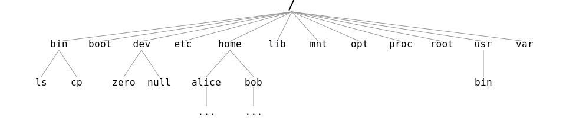

<div text-left>
<div op-80 text-xl>Linux 101 第 5 章</div>
<h1 class="text-4xl! leading-12!">
用户与用户组<br>
文件权限<br>
文件系统层次结构
</h1>
</div>

---

# 用户与用户组

<div />

只有我一个人使用电脑，为什么还要有「用户」和「用户权限」的概念？

<carbon-arrow-down />

古老的操作系统：没有用户概念 / 没有权限管理

<carbon-arrow-down />

现代操作系统：用户与权限严格隔离

---
layout: two-cols
layoutClass: gap-4
---

### 服务器场景{.text-primary.mb-4}

- 张三: 管理员
- 李四: 数据库管理员
- 王五: 普通用户

- www-data 用户: 运行 Web 服务器
- mysql 用户: 运行数据库服务

::right::

### 个人电脑场景 (Windows){.text-primary.mb-4}

- 你: （唯一）使用者

- <span text-nowrap>Administrator: 安装软件、修改系统配置</span>
- System: 最高权限用户
- TrustedInstaller: 安装系统组件


---

# /etc/passwd {.font-mono}

存储用户账户信息

```text
root:x:0:0:root:/root:/bin/bash
daemon:x:1:1:daemon:/usr/sbin:/usr/sbin/nologin
bin:x:2:2:bin:/bin:/usr/sbin/nologin
...
sshd:x:110:65534::/run/sshd:/usr/sbin/nologin
me:x:1000:1000:me:/home/me:/bin/bash 
lxd:x:998:100::/var/snap/lxd/common/lxd:/bin/false 
mysql:x:111:116:MySQL Server,,,:/nonexistent:/bin/false
```

<div class="mt-4 text-sm bg-gray-100 p-2 rounded font-mono overflow-x-auto">
<span class="text-red-600">用户名</span>:<span class="text-gray-400">密码占位</span>:<span class="text-blue-600">UID</span>:<span class="text-green-600">GID</span>:<span class="text-purple-600">描述</span>:<span class="text-orange-600">家目录</span>:<span class="text-teal-600">Shell</span>
</div>

<div class="mt-4 text-sm opacity-60 ml-2px">
注：用户密码哈希实际存储在 <code>/etc/shadow</code> (仅 root 可读)
</div>

---

# root 用户 (Superuser)

- **权限最高**：可以对系统做任何操作（包括删除系统）。

- **UID 为 0**：系统通过 UID=0 识别超级用户。

- **家目录**：`/root` (不同于普通用户的 `/home`)

---

# 系统用户 (System Users)

```text {2,3,5,7,8}
root:x:0:0:root:/root:/bin/bash
daemon:x:1:1:daemon:/usr/sbin:/usr/sbin/nologin
bin:x:2:2:bin:/bin:/usr/sbin/nologin
...
sshd:x:110:65534::/run/sshd:/usr/sbin/nologin
me:x:1000:1000:me:/home/me:/bin/bash 
lxd:x:998:100::/var/snap/lxd/common/lxd:/bin/false 
mysql:x:111:116:MySQL Server,,,:/nonexistent:/bin/false
```

<div h-2 />

- 运行后台服务 (Daemons) 

- 隔离服务权限，如果服务被攻破，攻击者只能获得该服务的低权限

---

# 普通用户 (Normal Users)

```text {6}
root:x:0:0:root:/root:/bin/bash
daemon:x:1:1:daemon:/usr/sbin:/usr/sbin/nologin
bin:x:2:2:bin:/bin:/usr/sbin/nologin
...
sshd:x:110:65534::/run/sshd:/usr/sbin/nologin
me:x:1000:1000:me:/home/me:/bin/bash 
lxd:x:998:100::/var/snap/lxd/common/lxd:/bin/false 
mysql:x:111:116:MySQL Server,,,:/nonexistent:/bin/false
```

<div h-2 />

- 普通用户的家目录位于 `/home/username` 中

- 无法直接修改系统配置，安装/卸载软件

---

# sudo {.font-mono}

以其他用户的身份执行命令

<div pb-4 flex gap-4>
<del><span underline>su</span><span >peruser</span> <span underline>do</span></del>
<div><span underline>su</span><span>bstitute user,</span> <span underline>do</span></div>
</div>

```bash
# 以 root 的身份运行程序
sudo ./program

# 以用户 nobody 的身份运行程序
sudo -u nobody ./program

# 以 root 的身份运行上一条命令
sudo !!
```

配置文件：[/etc/sudoers]{.font-mono} （建议使用 `visudo` 命令编辑）

---

# su {.font-mono}

**S**witch **U**ser - 切换用户身份

<div class="grid grid-cols-2 gap-4">
<div>

```console
$ su
Password: 
su: Authentication failure
```
<div class="text-sm text-red-500 mt-2">
一些发行版默认禁用 root 密码登录。
</div>

</div>
<div>

```console
$ sudo su -
[sudo] password for me:
#
```
<div class="text-sm text-green-600 mt-2">
推荐方式。保留了 sudo 的审计记录。
</div>

</div>
</div>

sudo su, sudo su -, sudo -i

---

# 用户组

- 用户的集合
- 为一批用户设置权限
- GID: 用户组 ID

<div h-4 />

```console {*}{class:'children:text-sm!'}
$ groups
me adm cdrom sudo dip plugdev users lpadmin docker
```

- me: 用户的主组，与用户名相同
- sudo: 允许使用 sudo 命令（根据[/etc/sudoers]{.font-mono}）
- docker: 无须提权即可使用 Docker（安全性上等同于直接赋予该用户 root 权限）

---

# [adduser]{.font-mono}

简单配置用户 (Debian)

```console {*}{class:'children:text-sm!'}
$ sudo adduser 用户名
$ sudo adduser --group 组名
$ sudo adduser 用户名 组名
```

更多需求？ => usermod, useradd, groupadd

---

# 文件权限

<div />

```console {*}{class:'children:text-sm!'}
$ ls -l
total 2 
drwxrwxr-x 2 me me 4096 Feb 3 22:38 a_folder
-rwxrw-r-- 1 me me   40 Feb 3 22:37 a_file
```

<svg width="600" height="80" viewBox="0 0 600 100" class="font-mono ml--16 mt-4">
  <!-- Type -->
  <rect x="10" y="10" width="40" height="40" fill="#eee" stroke="#333" />
  <text x="30" y="35" text-anchor="middle">-</text>
  <text x="30" y="70" text-anchor="middle" font-size="4">类型</text>
  <text x="30" y="90" text-anchor="middle" font-size="8">↓</text>

  <!-- User -->
  <rect x="60" y="10" width="100" height="40" fill="#e0f2f1" stroke="#333" />
  <text x="110" y="35" text-anchor="middle">r w x</text>
  <text x="110" y="70" text-anchor="middle" font-size="4">所有者 (u)</text>

  <!-- Group -->
  <rect x="170" y="10" width="100" height="40" fill="#e3f2fd" stroke="#333" />
  <text x="220" y="35" text-anchor="middle">r w -</text>
  <text x="220" y="70" text-anchor="middle" font-size="4">所属组 (g)</text>

  <!-- Others -->
  <rect x="280" y="10" width="100" height="40" fill="#f3e5f5" stroke="#333" />
  <text x="330" y="35" text-anchor="middle">r - -</text>
  <text x="330" y="70" text-anchor="middle" font-size="4">其他人 (o)</text>

  <!-- Links -->
  <rect x="390" y="10" width="40" height="40" fill="#fff" stroke="#333" />
  <text x="410" y="35" text-anchor="middle">1</text>
  <text x="410" y="70" text-anchor="middle" font-size="4">链接数</text>

  <!-- Owner -->
  <rect x="440" y="10" width="100" height="40" fill="#fff3e0" stroke="#333" />
  <text x="490" y="35" text-anchor="middle">me</text>
  <text x="490" y="70" text-anchor="middle" font-size="4">所有者</text>

  <!-- Group Name -->
  <rect x="550" y="10" width="100" height="40" fill="#ede7f6" stroke="#333" />
  <text x="600" y="35" text-anchor="middle">me</text>
  <text x="600" y="70" text-anchor="middle" font-size="4">所属组</text>
</svg>

<div class="text-xs ml-1 bg-#eee w-fit px-2 py-1" border="#333 1">

<div class="flex gap-4">
<div>

- **-**: 普通文件
- **d**: 目录 (Directory)
- **l**: 软链接 (Link)

</div>
<div>

- **c**: 字符设备文件 (Character Device)
- **b**: 块设备文件 (Block Device)
- **s**: 套接字文件 (Socket)
- **p**: 命名管道文件 (Named Pipe)

</div>
</div>

</div>

---

# 权限的含义

| **权限** | **对文件的含义** | **对目录的含义** |
|---|---|---|
| **r (Read)** | 查看文件内容 | 列出目录内容 (`ls`) |
| **w (Write)** | 修改文件内容 | 在目录中创建/删除文件 |
| **x (Execute)** | 运行程序/脚本 | **进入**目录 (`cd`) |
| **s (Setuid/Setgid)** | 以文件所有者/组的权限运行程序 | ... |

<div text-xs mt-4 op-60>

https://wiki.archlinux.org/title/File_permissions_and_attributes#Viewing_permissions

</div>

<style>

.slidev-layout td, .slidev-layout th {
  padding: 0.5rem;
}

</style>

---

# chmod

**Ch**ange **Mod**e - 修改权限

<div class="grid grid-cols-2 gap-8">
<div>

#### 符号模式 (Symbolic)

<span font-mono> \[u/g/o/a\] \[+/-/=\] \[r/w/x\] </span>

```bash {*}{class:'children:text-sm!'}
chmod +x script.sh

chmod o-w file.txt

chmod a+r file.txt
```

</div>
<div>

#### 数字模式 (Numeric)

<span font-mono> r=4, w=2, x=1 </span>

```bash {*}{class:'children:text-sm!'}
# rwx r-x r-x
# 7   5   5
chmod 755 program

# rw- --- ---
# 6   0   0
chmod 600 private.key
```

</div>
</div>

---
layout: two-cols
layoutClass: gap-8
---

# chown

**Ch**ange **Own**er - 修改所有者

```bash {*}{class:'children:text-sm!'}
# 修改文件所有者
chown user file.txt

# 修改文件所有者和组
chown user:group file.txt

# 递归修改目录及其内容
chown -R user:group directory/
```

::right::

# chgrp

**Ch**ange **Gr**ou**p** - 仅修改所属组

```bash {*}{class:'children:text-sm!'}
chgrp group file.txt
```

---

# 更细节权限控制

- ACL: 细粒度权限控制

- File attributes: 只读、不可删除等

- Capabilities: Root 权限的碎片化

- MAC (SELinux / AppArmor): 强制访问控制

- Seccomp: 系统调用防火墙

---

# 文件系统层次结构 (FHS)

[**F**ilesystem **H**ierarchy **S**tandard](https://refspecs.linuxfoundation.org/FHS_3.0/fhs/index.html)




---

<FHSDir path="/bin" title="Binaries (➝ /usr/bin)">
  程序文件，对所有用户都可用。如 cat, ls, cp, su
</FHSDir>

<FHSDir path="/sbin" title="System binaries (➝ /usr/sbin)">
  系统管理，以及仅用于 root 用户的程序。如 fsck, reboot
</FHSDir>

<FHSDir path="/etc" title="Configuration">
  系统级配置。一些典型的文件：

- `/etc/{passwd,shadow,sudoers}`
- `/etc/resolv.conf`: 系统 DNS 服务器配置
- `/etc/hosts`: 主机名和 IP 地址的对应表
- `/etc/apt/sources.list.d/ubuntu.sources`: Ubuntu 系统软件源
</FHSDir>

---

<FHSDir path="/root" title="Root user home directory">
超级用户家目录
</FHSDir>

<FHSDir path="/home" title="Home directory of normal users">
普通用户家目录：<code>/home/username</code>
</FHSDir>

<FHSDir path="/lib" title="Libraries (➝ /usr/lib)">
存放系统运行所需的程序库文件<br>
一些典型的文件：

- `/lib/x86_64-linux-gnu/libc.so.6`: glibc 库 (GNU C 库)
- `/lib/x86_64-linux-gnu/ld-linux-x86-64.so.2`: 动态链接器与加载器

</FHSDir>

---

<FHSDir path="/mnt" title="Mount">
临时挂载的文件系统<br>
WSL: <code>/mnt/c</code>, <code>/mnt/d</code> 等
</FHSDir>

<FHSDir path="/media" title="Media">
可移除设备，如 U 盘、光驱等
</FHSDir>

<FHSDir path="/boot" title="Boot">
启动加载器文件。一些典型的文件：

- `/boot/grub/`: 存储 GRUB 启动引导器的内容
- `/boot/initrd.img`: Linux 启动时的初始 RAM 磁盘
- `/boot/vmlinuz`: Linux 内核
</FHSDir>

---

<FHSDir path="/opt" title="Optional / Add-on applications">
第三方大型商业软件 (如 Chrome) 常安装于此。
</FHSDir>

<FHSDir path="/var" title="Variable Data">
会发生变化的数据文件：

- `/var/log`: 日志文件
- `/var/lib`: 应用程序数据，如数据库文件
- `/var/cache`: 缓存文件
- `/var/tmp`: 重启保留的临时文件
</FHSDir>

<FHSDir path="/srv" title="Service Data">
系统服务的数据
</FHSDir>

---

<FHSDir path="/run" title="Runtime Data">
存储进程 PID 文件、Socket 文件等。内存文件系统，重启消失。

- `/run/crond.pid`: cron 服务的 PID
- `/run/docker.sock`: Docker 守护进程的 Socket 文件
</FHSDir>

<FHSDir path="/tmp" title="Temporary">
  重启后会被清空。任何用户都可读写。
</FHSDir>

---

<FHSDir path="/dev" title="Devices">

- `/dev/sda`: 第一块硬盘
- `/dev/null`: 黑洞 (丢弃一切写入)
  <span float-right translate-x-12 font-mono text-sm pt-2>command > /dev/null 2>&1</span>
- `/dev/zero`: 产生无限的 0
  <span float-right translate-x-12 font-mono text-sm pt-2>dd if=/dev/zero of=file bs=1M count=1024</span>
- `/dev/urandom`: 随机数生成器

</FHSDir>

<FHSDir path="/proc" title="Process">

- `/proc/cpuinfo`: CPU 信息
- `/proc/meminfo`: 内存信息

</FHSDir>

<FHSDir path="/sys" title="System">
  硬件设备属性 (虚拟)
</FHSDir>

---

<FHSDir path="/usr" title="">
  存放用户程序和共享数据的目录

- `/usr/bin`
- `/usr/lib`
- `/usr/sbin`
- `/usr/include`
- `/usr/local`
- `/usr/share`
</FHSDir>

---
layout: two-cols
---

# apt install 

- 可执行程序 <carbon-arrow-right /> [/bin/]{.font-mono}
- 配置文件 <carbon-arrow-right /> [/etc/]{.font-mono}
- 库文件 <carbon-arrow-right /> [/lib/]{.font-mono}
- 资源文件 <carbon-arrow-right /> [/usr/share/]{.font-mono}
- 日志文件 <carbon-arrow-right /> [/var/log/]{.font-mono}
- 数据文件 <carbon-arrow-right /> [/var/lib/]{.font-mono}

::right::

<div float-right>

```bash {*}{class:'children:text-sm!'}
$ dpkg -L nginx
/.
/usr
/usr/sbin
/usr/sbin/nginx
/usr/share
/usr/share/doc
/usr/share/doc/nginx
/usr/share/doc/nginx/changelog.Debian.gz
/usr/share/doc/nginx/copyright
/usr/share/man
/usr/share/man/man8
/usr/share/man/man8/nginx.8.gz
```

</div>

---

# 总结

<div class="grid grid-cols-3 gap-4 text-center">

<div class="p-4 border rounded">
<div class="text-4xl mb-2 mx-auto op-70 i-carbon-user"></div>
<div class="font-bold">用户与用户组</div>
<div class="text-sm mt-2">Root vs 普通用户<br>UID/GID<br>sudo</div>
</div>

<div class="p-4 border rounded">
<div class="text-4xl mb-2 mx-auto op-70 i-carbon-locked"></div>
<div class="font-bold">文件权限</div>
<div class="text-sm mt-2">rwx<br>chmod<br>chown</div>
</div>

<div class="p-4 border rounded">
<div class="text-4xl mb-2 mx-auto op-70 i-carbon-folders"></div>
<div class="font-bold">文件系统层次结构</div>
<div class="text-sm mt-2">FHS<br>/etc, /home, /var<br>一切皆文件</div>
</div>

</div>